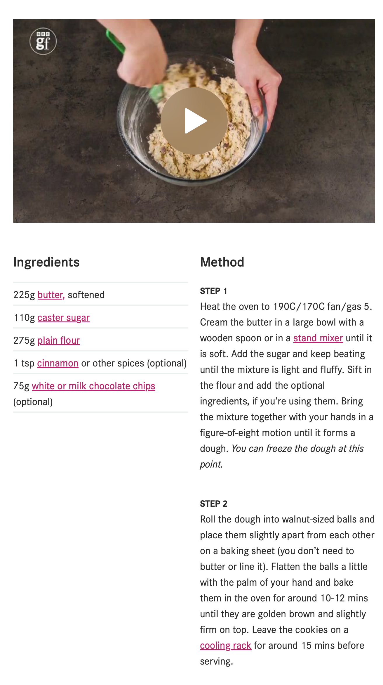

# My Favourite Cookie Recipe!
### Recipe

This is my favourite cookie recipe, I found it online via this link *https://www.bbcgoodfood.com/recipes/basic-cookies*. 

### Ingredients
1. 225g butter, softened
2. 110g caster sugar
3. 275g plain flour
4. 1 tsp cinnamon or other spices (optional)
5. 75g white or milk chocolate chips (optional)

### Method
**STEP 1**
Heat the oven to 190C/170C fan/gas 5. Cream the butter in a large bowl with a wooden spoon or in a stand mixer until it is soft. Add the sugar and keep beating until the mixture is light and fluffy. Sift in the flour and add the optional ingredients, if you’re using them. Bring the mixture together with your hands in a figure-of-eight motion until it forms a dough. You can freeze the dough at this point.

**STEP 2**
Roll the dough into walnut-sized balls and place them slightly apart from each other on a baking sheet (you don’t need to butter or line it). Flatten the balls a little with the palm of your hand and bake them in the oven for around 10-12 mins until they are golden brown and slightly firm on top. Leave the cookies on a cooling rack for around 15 mins before serving.

### Notes
This is the recipe for a basic butter cookie but it can be modified easily by simply adding other ingredients such as **chocolate chips** or **dried fruits**.

